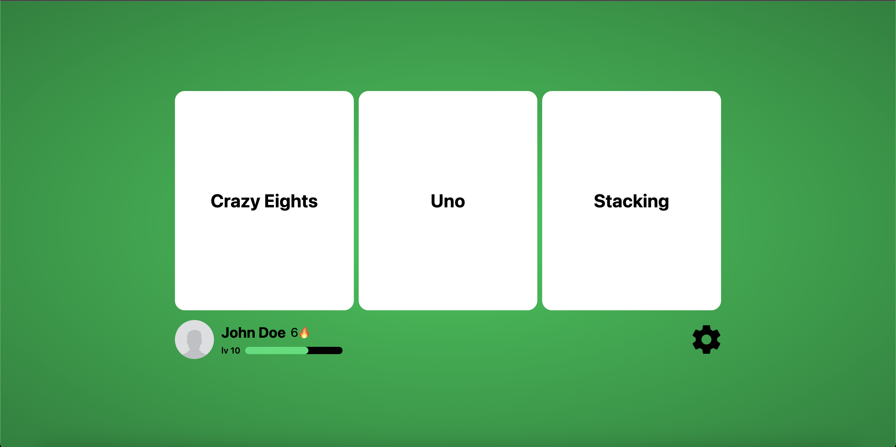

# Project One

## Description

This project is a web-based progressive web application (PWA) that recreates the classic card game Crazy Eights with additional gameplay modes inspired by Uno. The application allows players to play multiplayer games without requiring downloads, accounts, or centralized servers.

The system supports multiple game modes including classic Crazy Eights, Uno-like rules, and stacking mechanics. Players can customize game settings such as number of players, starting cards, and draw rules. Multiplayer functionality is implemented using peer-to-peer (P2P) communication via WebRTC, enabling real-time gameplay through shared room IDs.

The project aims to provide a lightweight, accessible, and customizable card game experience that can be played directly from any modern web browser. It also includes AI-controlled opponents that make optimal moves based on the current game state.



# Getting Started

### Prerequisites

- [Node.js](https://nodejs.org/en/)
- Npm (Comes with Node.js)
- [Git](https://git-scm.com/)

### Installation

1. Open your terminal and run the following commands to confirm Git and Node.js installations.

```
git --version
node -v
npm -v
```

2. After confirming the installation, clone the repo and change the directory

```
git clone https://github.com/cis3296s26/final-project-04-project-one.git
cd final-project-04-project-one/frontend
```

3. Install NPM packages

```
npm install
```

4. Run in development mode

```
npm run dev
```

# How to contribute

Follow this project board to know the latest status of the project: [https://project-juan.atlassian.net/jira]([https://project-juan.atlassian.net/jira])

### How to build

- Use this github repository: ...
- Specify what branch to use for a more stable release or for cutting edge development.
- Use InteliJ 11
- Specify additional library to download if needed
- What file and target to compile and run.
- What is expected to happen when the app start.
